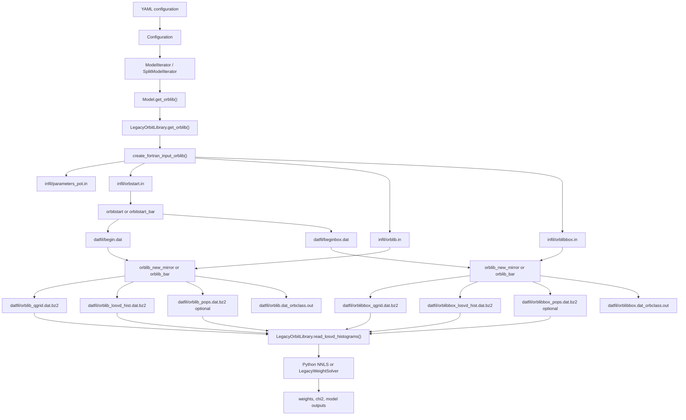
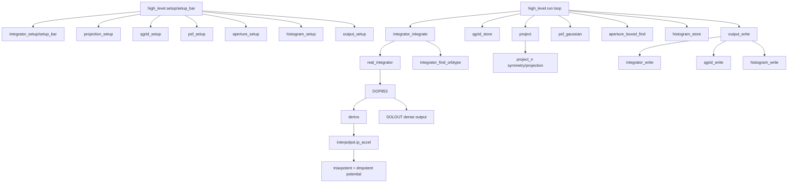
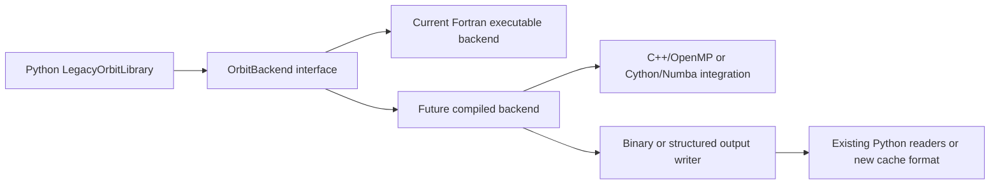

# Fortran Orbit-Library Engine Analysis

Date: 2026-06-02

Scope: `legacy_fortran/orblib_f_new_mirror.f90`, the two executable drivers
that use it (`orblibprogram.f90` and `orblibprogram_bar.f90`), and the Python
runtime boundary in `dynamite/orblib.py` and `dynamite/model_iterator.py`.

This note focuses on what the orbit-library Fortran code does, how it is wired
into DYNAMITE, where the expensive computation is, and what a replacement would
need to preserve.

## Executive Summary

`orblib_f_new_mirror.f90` is not just an ODE integrator. It is the current
compiled orbit-library backend. For each model it:

- reads MGE/potential/orbit-library settings prepared by Python,
- reads orbit initial conditions from `begin.dat` or `beginbox.dat`,
- integrates orbit trajectories with DOP853,
- classifies orbit families from angular-momentum sign behavior,
- projects each integrated trajectory through triaxial or barred-model
  symmetry rules,
- applies PSF convolution by Monte Carlo displacements,
- maps projected points into observed apertures and spatial bins,
- bins line-of-sight velocities into LOSVD histograms,
- accumulates intrinsic 3D moment grids,
- writes binary Fortran record files that Python later reads.

The computationally dominant work is orbit integration plus per-sample
projection/PSF/aperture/histogram loops. The Fortran executable itself is
effectively single-process and single-threaded. DYNAMITE gets parallelism by
running several model processes at once and, optionally, by running the tube
and box orbit-library executables concurrently.

Replacing this with pure Python would be risky and likely slow unless the hot
loops are moved to compiled code. A realistic replacement should use a compiled
backend such as C++/OpenMP, Cython, Numba, or a carefully vectorized NumPy
design, with parity tests against the current Fortran binary outputs.

## Runtime Connection Diagram



Key source points:

- Python writes Fortran input files in `LegacyOrbitLibrary.create_fortran_input_orblib()`.
- Python launches `orbitstart*` in `LegacyOrbitLibrary.get_orbit_ics()`.
- Python chooses `orblib_new_mirror` or `orblib_bar` in
  `write_executable_for_integrate_orbits*()`.
- Python reads the Fortran binary records in `read_orbit_base()` and
  `read_losvd_histograms()`.

## Internal Fortran Module Map

`orblib_f_new_mirror.f90` is one large source file with many modules. The two
driver programs are thin:

- `orblibprogram.f90` calls `setup()`, `run()`, and `stob()`.
- `orblibprogram_bar.f90` calls `setup_bar()`, `run()`, and `stob()`.

The main in-file coordinator is `module high_level`.



## Main Execution Flow

For each Fortran orbit-library executable invocation:

1. `setup()` or `setup_bar()` initializes modules.
2. `integrator_setup()` reads the potential parameters and the orbit-start file.
3. `projection_setup()` sets triaxial projection angles and the number of
   symmetry projections.
4. `qgrid_setup()` allocates the intrinsic 3D moment grid.
5. `psf_setup()` reads PSF definitions and builds random sigma maps.
6. `aperture_setup()` reads each aperture file and records which PSF and
   histogram dimensionality belongs to it.
7. `histogram_setup()` reads velocity histogram definitions and spatial binning.
8. `output_setup()` opens or resumes output files.
9. `run()` loops over orbit bundles.
10. For each bundle it loops over `dithering^3` individual starting points.
11. Each dithered trajectory is integrated with DOP853.
12. The dense trajectory samples are classified, stored into the intrinsic
    grid, projected, PSF-convolved, aperture-mapped, and velocity-binned.
13. `output_write()` appends one orbit bundle's qgrid and LOSVD data.
14. `stob()` closes output and module state.

The Fortran variable naming is easy to misread around `dithering`. The code
stores one output orbit bundle for a group of `dithering^3` integrated
trajectories. Internally, `integrator_number` is based on
`nEner * nI2 * nI3 / dithering^3`, and each output bundle integrates
`dithering^3` dithered trajectories. Python-facing docs also talk about total
physical trajectories and mirrored tube-orbit variants, so the exact "orbit
count" depends on whether one means integrated starting trajectories, output
bundles, tube/box files, or final combined weight-solver columns.

## Module Responsibilities

### `random_gauss_generator`

Generates Gaussian random offsets for PSF convolution. It uses `ran1` and
single-precision internal work for speed. This affects reproducibility and
should be treated as part of the numerical output contract.

### `integrator`

This is the core trajectory engine.

Important routines:

- `integrator_setup()` / `integrator_setup_bar()`: read model parameters,
  initialize the interpolated potential, read integration settings, read
  initial conditions, allocate dither arrays.
- `ini_integ()`: reads `begin.dat` or `beginbox.dat`.
- `integrator_whichorbit()`: maps an output bundle index and dither index back
  to the actual start point in the full initial-condition grid.
- `real_integrator()`: calls DOP853 and performs energy-conservation retry
  logic.
- `derivs()`: returns the 6D ODE right-hand side. Non-barred models integrate
  in the inertial frame. Barred models add rotating-frame terms using `Omega`.
- `SOLOUT()`: samples dense DOP853 output into fixed arrays `pos_t` and `vel_t`.
- `integrator_find_orbtype()`: classifies orbit type using sign changes of
  angular momentum components and stores time-averaged orbit properties.

Critical points:

- `derivs()` calls `ip_accel()` for every DOP853 force evaluation. This is the
  primary numerical hot path.
- `real_integrator()` retries at tighter tolerance when final energy drift is
  above 1 percent.
- The dense-output callback writes fixed-size sample arrays. A replacement must
  decide exactly how to handle short fills, oversampling, and retry behavior.
- The barred path changes both the ODE and later symmetry handling.

### `projection`

Projects 3D positions and velocities to sky coordinates and line-of-sight
velocities. It applies hard-coded sign matrices for orbit-family symmetries.

Critical points:

- Non-rotating models use an 8-fold triaxial symmetry pattern.
- Rotating barred models use a reduced 4-fold symmetry pattern through changed
  sign matrices.
- The line-of-sight velocity sign behavior is part of the orbit-library
  ordering expected later by Python and the weight solvers.

### `psf`

Applies PSF convolution by randomly displacing projected points.

Cost drivers:

- number of sampled trajectory points,
- number of PSF definitions,
- number of Gaussian components per PSF,
- random-number generation and per-point array writes.

The routine `psf_gaussian()` contains a serialized loop when choosing random
Gaussian components for multi-Gaussian PSFs. That is a performance and
reproducibility-sensitive section.

### `aperture` and `aperture_boxed`

Read boxed aperture definitions and map projected points into spatial pixels.

`aperture_boxed_find()` loops over every projected sample point and checks
whether it lands inside the rotated aperture rectangle. If it does, it computes
the pixel index.

This code is simple but hot because it is called inside:

- each output orbit bundle,
- each dithered trajectory,
- each projection,
- each PSF,
- each aperture.

### `binning`

Maps aperture pixels into science bins, usually by summing pixel histograms.
This happens after raw histogram accumulation, before writing LOSVD data.

This is usually less expensive than integration and projection, but it is part
of the binary output contract because it determines the number and order of
aperture constraints stored in the orbit library.

### `histograms`

Accumulates LOSVD histograms.

Important routines:

- `histogram_velbin()`: maps line-of-sight velocities to velocity-bin indices.
- `histogram_store()`: increments histogram counts for aperture/bin/velocity.
- `histogram_write()`: normalizes and writes sparse-compatible velocity
  histogram records.

Critical points:

- First and last velocity bins are later treated specially by Python NNLS code,
  which zeros them to mimic Fortran behavior.
- The output is sparse in velocity: for each aperture, Fortran writes the
  minimum and maximum occupied velocity-bin offsets, then only the occupied
  range.
- Python reconstructs dense arrays from this sparse record layout.

### `quadrantgrid`

Accumulates intrinsic orbit moments in an octant grid over radius, theta, and
phi.

For each trajectory sample it applies symmetry signs and stores:

- density count,
- mean position components,
- first velocity moments,
- second velocity moments,
- orbit-type counters.

This grid is used for intrinsic mass/moment constraints and later analysis. It
is smaller than the LOSVD arrays in many configurations, but it is called for
every integrated trajectory sample, so it is still performance-relevant.

### `output`

Owns binary output files and the `.tmp` resume/status mechanism.

Outputs include:

- `*_qgrid.dat`: Fortran unformatted records for orbit intrinsic grid data.
- `*_losvd_hist.dat`: Fortran unformatted records for projected LOSVD
  histograms.
- `*_pops.dat`: optional 0D projected population-mass records.
- `*.dat_orbclass.out`: formatted orbit-classification and time-average
  property file.
- `*.tmp`: resume/status marker.

Critical points:

- Output is append-oriented.
- The code attempts to resume from a `.tmp` status file.
- Python later compresses the raw `.dat` files with `bzip2`.
- Any replacement must either write the same binary record layout or change all
  downstream readers and reference tests.

## Computational Hot Spots

### 1. DOP853 Orbit Integration

This is usually the dominant CPU cost. For each integrated trajectory DOP853
performs many adaptive steps. Every step calls `derivs()`, and `derivs()` calls
the interpolated potential acceleration.

Power needed:

- High single-core CPU performance matters.
- More cores help only by running multiple independent orbit-library processes.
- GPU/iGPU acceleration is not naturally used by this code path.

### 2. Potential Acceleration

The force evaluation is delegated to `interpolpot.ip_accel()`, backed by the
MGE potential and dark halo setup from `triaxpotent` and `dmpotent`. The whole
point of `interpolpot` is to avoid evaluating the full MGE potential integrals
on every ODE step.

Power needed:

- Cache-friendly scalar floating-point performance.
- Avoiding unnecessary interpolation-grid rebuilds matters.

### 3. Projection, PSF, Aperture, Histogram Loops

After each trajectory is sampled, the code processes many "photon" samples:

```text
for each output orbit bundle
  for each dithered trajectory
    integrate trajectory
    store intrinsic qgrid samples
    for each symmetry projection
      project samples to sky
      for each PSF
        random PSF displacement
        for each aperture using that PSF
          map samples to aperture pixels
          store LOSVD histogram counts
```

The cost grows roughly with:

```text
integrated_trajectories
* sampling
* projections
* psf_count
* aperture_count
```

`sampling` can be large in real configs, often tens of thousands. This makes
these loops important even if DOP853 is the main numerical kernel.

### 4. Disk I/O And Compression

Fortran writes binary unformatted records. Python-created shell scripts then
compress files with `bzip2`, and Python later decompresses them into temporary
files to read with `scipy.io.FortranFile`.

This is not the main floating-point cost, but it can be a large wall-clock and
failure-mode contributor for big orbit libraries or slow disks.

## Existing Parallelism

There is no clear internal OpenMP parallel region in `orblib_f_new_mirror.f90`.
Parallelism is process-level:

- `ModelInnerIterator` uses `pathos.multiprocessing.Pool` with `ncpus` to run
  multiple model jobs in parallel.
- `SplitModelIterator` runs orbit-library creation with `ncpus`, then weight
  solving with `ncpus_weights`.
- `orblibs_in_parallel: True` runs tube and box orbit-library executables
  concurrently for one model. That means up to two Fortran orbit-library
  processes per active model.

Practical CPU planning:

- With `orblibs_in_parallel: False`, active Fortran orbit jobs are roughly
  `ncpus`.
- With `orblibs_in_parallel: True`, active Fortran orbit jobs can be roughly
  `2 * ncpus`.
- On the local TUXEDO Pulse 15 Gen1 baseline, the CPU has 8 cores / 16 threads.
  For orbit integration, physical cores are usually the meaningful limit.
- Avoid setting `ncpus: all_available` together with
  `orblibs_in_parallel: True` unless the machine has enough cores and I/O
  headroom for twice as many Fortran jobs.
- If Python NNLS uses BLAS-backed routines in parallel, cap BLAS/OpenMP threads
  so model-process parallelism and BLAS thread parallelism do not oversubscribe
  the CPU.

## Replacement Difficulty

### What Is Easy To Replace

The shell/process boundary can be improved without changing the science:

- safer command execution,
- better nonzero status propagation,
- explicit output manifests,
- improved temp-file handling,
- less repeated compression/decompression.

These changes do not replace the Fortran numerical kernel.

### What Is Moderately Replaceable

The Python side already replaced projected and intrinsic mass calculations for
the Python `NNLS` weight solver path. The legacy Fortran mass helpers are not
central to this orbit-library engine.

### What Is Hard To Replace

Replacing `orblib_f_new_mirror.f90` means reproducing:

- DOP853 integration behavior,
- potential interpolation and retry rules,
- random-number behavior for PSF convolution,
- symmetry and sign conventions,
- barred rotating-frame behavior,
- orbit-family classification,
- dither grouping and output ordering,
- sparse LOSVD record layout,
- qgrid moment layout,
- Python mirroring/interlacing expectations.

Pure Python loops are the wrong default for this unless the problem sizes stay
tiny. A compiled backend is more realistic.

## Possible Replacement Architecture

A replacement should probably keep Python orchestration and replace the Fortran
process with a versioned backend interface:



Recommended stages:

1. Add timing manifests around existing Fortran runs.
2. Preserve current Fortran output as reference fixtures.
3. Isolate the expected output contract in Python tests.
4. Prototype one narrow backend component, such as reading begin files and
   reproducing projection/binning for a small frozen trajectory.
5. Only then prototype an alternative integrator path.
6. Compare orbit-library outputs, final weights, and chi2 values before
   changing defaults.

## Critical Regression Tests Needed Before Replacement

Minimum useful tests:

- A tiny non-barred triaxial fixture with fixed random seed.
- A barred fixture with nonzero `Omega`.
- A fixture with multiple kinematic apertures and multiple PSFs.
- A fixture with population-data `*_pops.dat` output.
- A fixture with `dithering > 1`.
- Binary-record parity for qgrid and LOSVD files.
- End-to-end parity for Python `NNLS` weights and chi2.
- Failure-mode tests for malformed input and interrupted output/resume state.

## Practical Conclusion

The current Fortran orbit-library engine is there because it contains the
working compiled implementation of the Schwarzschild orbit-library generation
pipeline. Its main advantage over pure Python is not just raw ODE speed. It is
that the integration, projection, PSF, binning, symmetry, dither grouping, and
file format have all accumulated into one coupled backend.

The best near-term performance path is to keep the Fortran kernel, control
process-level parallelism carefully, and improve logging/status/output
robustness. The best long-term replacement path is a compiled backend with
strict parity tests, not a direct pure-Python rewrite.
